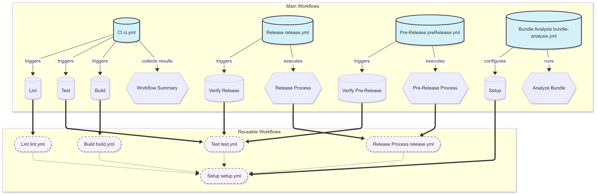
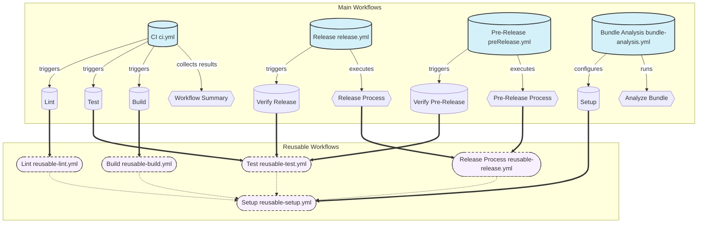

# GitHub Actions Workflows

This directory contains GitHub Actions workflows for automating various tasks in the project.

## Workflow Architecture Diagram

## Main Workflows

| Workflow        | File                                         | Description                                                                                                                         |
| --------------- | -------------------------------------------- | ----------------------------------------------------------------------------------------------------------------------------------- |
| CI              | [ci.yml](./ci.yml)                           | Main continuous integration workflow that runs on push to main branches and pull requests. Includes linting, testing, and building. |
| Release         | [release.yml](./release.yml)                 | Handles production releases from main/master branches.                                                                              |
| Pre-Release     | [preRelease.yml](./preRelease.yml)           | Handles pre-releases from dev/develop branches.                                                                                     |
| Bundle Analysis | [bundle-analysis.yml](./bundle-analysis.yml) | Analyzes Next.js bundle size and comments on PRs with changes.                                                                      |

## Reusable Workflows

These workflows are not meant to be triggered directly but are used as components in the main workflows:

| Workflow        | File                                           | Description                                                                     |
| --------------- | ---------------------------------------------- | ------------------------------------------------------------------------------- |
| Setup           | [reusable-setup.yml](./reusable-setup.yml)     | Sets up the Node.js environment, installs dependencies, and configures caching. |
| Test            | [reusable-test.yml](./reusable-test.yml)       | Runs various types of tests (unit, E2E, smoke) with matrix support.             |
| Lint            | [reusable-lint.yml](./reusable-lint.yml)       | Runs linting checks (TypeScript, ESLint, Prettier, Stylelint).                  |
| Build           | [reusable-build.yml](./reusable-build.yml)     | Builds the application with various options.                                    |
| Release Process | [reusable-release.yml](./reusable-release.yml) | Handles the semantic release process.                                           |

## Workflow Architecture

The workflows are designed with the following principles:

1. **Reusability**: Common steps are extracted into reusable workflows.
2. **Parallelization**: Jobs run in parallel where possible to speed up execution.
3. **Caching**: Efficient caching is used to speed up builds and dependency installation.
4. **Security**: Secrets are handled securely and action versions are pinned.
5. **Concurrency**: Workflows use concurrency to prevent redundant runs.

## Triggering Workflows Manually

Some workflows can be triggered manually from the GitHub Actions tab:

- **CI**: Can be run on any branch to verify code quality.
- **Release/Pre-Release**: Can be run with a dry-run option to preview the release without publishing.
- **Bundle Analysis**: Can be run to analyze the current bundle size.

## Workflow Outputs

- **Test Reports**: Available as artifacts when tests are run.
- **Bundle Analysis**: Comments on PRs with bundle size changes.
- **Build Artifacts**: Available for download after successful builds.

## Customizing Workflows

To customize these workflows:

1. Edit the main workflow files to change triggers or job configurations.
2. Modify the reusable workflows to change the underlying implementation.
3. Add new workflows as needed for additional automation tasks.

## Security Considerations

- All external actions are pinned to specific versions for security.
- Secrets are passed securely to reusable workflows.
- Workflows are designed to minimize the risk of secret exposure.
