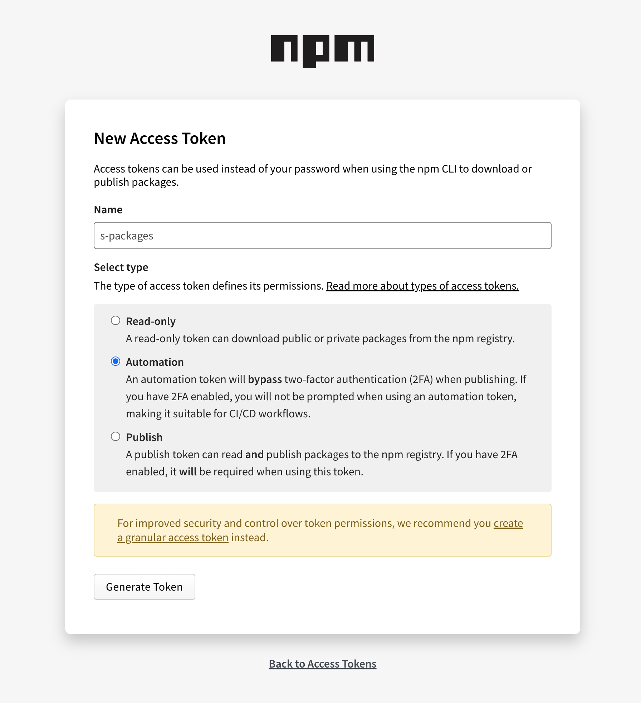
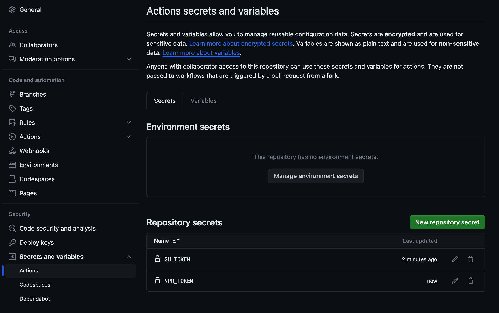
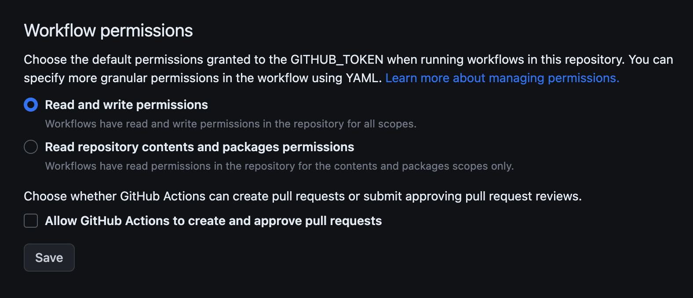

# Table of Contents

1. [Set up your repository](#set-up-your-repository)

- [Replace Details in tools/customize.json](#replace-details-in-customizesh)
- [Add Permissions and Run tools/customize.sh](#add-permissions-and-run-customizesh)

2. [Add Tokens for NPM and Github](#add-tokens-for-npm-and-github)

- [Set GH_TOKEN](#set-gh_token)
- [Add GH_TOKEN and NPM_TOKEN as Secrets](#add-gh_token-and-npm_token-as-secrets)

3. [Setup repository](#setup-repository)

- [Adjust Workflow Permissions](#adjust-workflow-permissions)

4. [Before Final Publish](#before-final-publish)

- [Remove Unnecessary Files](#remove-unnecessary-files)
- [Add Permissions and Run tools/cleanCustomize.sh](#add-permissions-and-run-cleancustomizesh)

5. [WayToWrok](WayToWrok.md)

- [How work with branch](#How-work-with-branch)

6. [known problems](knownProblem.md)

### Set up Tokens

#### Add Tokens for NPM(**Automation**), Github

Add your npm token to your GitHub repository secrets as `NPM_TOKEN`, `GH_TOKEN`

- Set `GH_TOKEN` - https://github.com/settings/tokens/new
- Set `NPM_TOKEN`, set automation type - https://www.npmjs.com/settings/{{PLACEHOLDER_NPM_USER}}/tokens/new

> **Reused tokens:**
> if you have any token form npm you can reuse it. It is not necessary to create new one for every repository. In my csae, I use one token for a group based on functionality.

- in Repository secrets Add `GH_TOKEN` and `NPM_TOKEN` it on https://github.com/{{PLACEHOLDER_GITHUB_USER}}/{{PLACEHOLDER_REPO_NAME}}/settings/secrets/actions as new repo secret
  

#### Setup github repository

Semantic release need read and write permissions to https://github.com/{{PLACEHOLDER_GITHUB_USER}}/{{PLACEHOLDER_REPO_NAME}}/settings/actions - > Workflow permissions -> check
Read and write permissions

### Before final publish

use `use customize:clean` it

- remove `docs` folder
- remove `mock` folder if it is not used
  - remove occurrence of `mock/*` in `.eslintignore`
- remove `__tests__` folder if it is not used
  - remove occurrence of `__tests__/*` in `.eslintignore`

### Publish

#### Pre-release

Pre-release is prepared from feature and dev branches.

#### Pre-production

Pre-production should be created with a pull request to the main branch.

#### Release

Release is created on the main branch and prepared by GitHub Actions.
